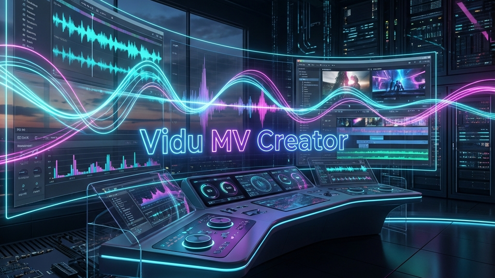

# Vidu MV Creator

**Suno V5 (Audio) x Vidu Q2 (Video)** 
物語からミュージックビデオを一気通貫で制作するための特化型ワークスペース

> [!NOTE]
> This project was architected and generated by **ZERO_GRAVITY** (Agentic AI Workspace).

## Workflow Overview
1.  **Story to Music**: テーマ/小説 -> 歌詞 -> Suno V5で楽曲生成 (`story-to-lyrics-flow.md`)
2.  **Visual Prep**: Midjourneyで「最強のリファレンス画像」を生成 (`50-ref-image-prompts.md`)
3.  **Video Gen**: Vidu Q2でリファレンスを参照しながらシーン生成 (`lyrics-to-mv-flow.md`)
4.  **Assembly**: 編集して完成

## ルール & ガイド (.agent/rules/)

### Core Integrations
- `10-vidu-q2-specs.md`: Vidu Q2 仕様 (Ref-to-Video)
- `40-suno-v5-specs.md`: Suno V5 仕様 (Lyrics, Personas)

### Visual Strategy
- `20-mv-direction.md`: 楽曲構成別の映像演出
- `50-ref-image-prompts.md`: **重要** Vidu用リファレンス画像プロンプト戦略
- `30-prompt-engineering.md`: Vidu基本プロンプト

### Editing
- `41-audio-visual-sync.md`: 音ハメとカット割りの技術

## ワークフロー (.agent/workflows/)
- `story-to-lyrics-flow.md`: ストーリーからSuno楽曲を作る
- `lyrics-to-mv-flow.md`: 楽曲とリファレンスからMVを作る（統合フロー）

## 使い方 (How to Start)
1. `.agent/workflows/story-to-lyrics-flow.md` を開き、ステップ1から始めてください。
2. 楽曲ができたら、`.agent/workflows/lyrics-to-mv-flow.md` に進んでください。

---
Generated by **ZERO_GRAVITY** Assistant (Seira)
